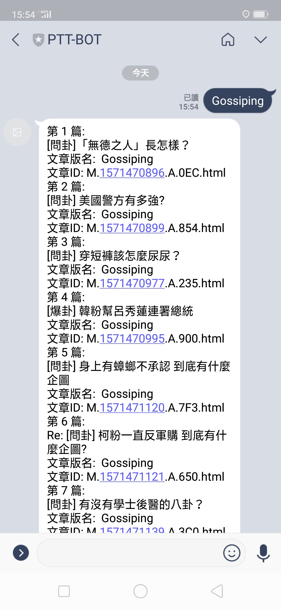
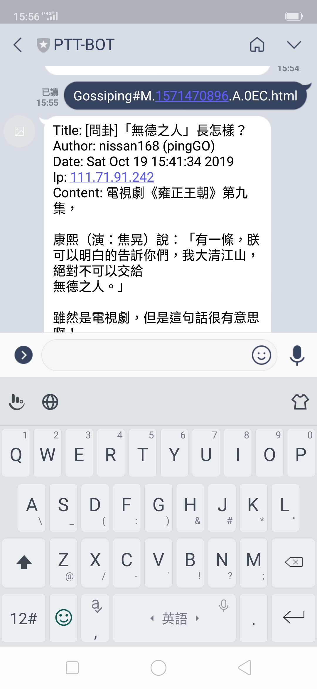

# What is PTT-BOT

PTT-BOT is an line application for the PTT community that can respond differently to users' requests.

## Example

## References
- [LINE Messaging API](https://developers.line.biz/en/services/messaging-api/)
- [LINE Messaging API SDK for Go](https://github.com/line/line-bot-sdk-go)
- [Getting Started with Go Query](https://github.com/PuerkitoBio/goquery)
- [Getting Started with Heroku](https://devcenter.heroku.com/start)
- [Getting Started with Go Dep](https://golang.github.io/dep/docs/introduction.html)
